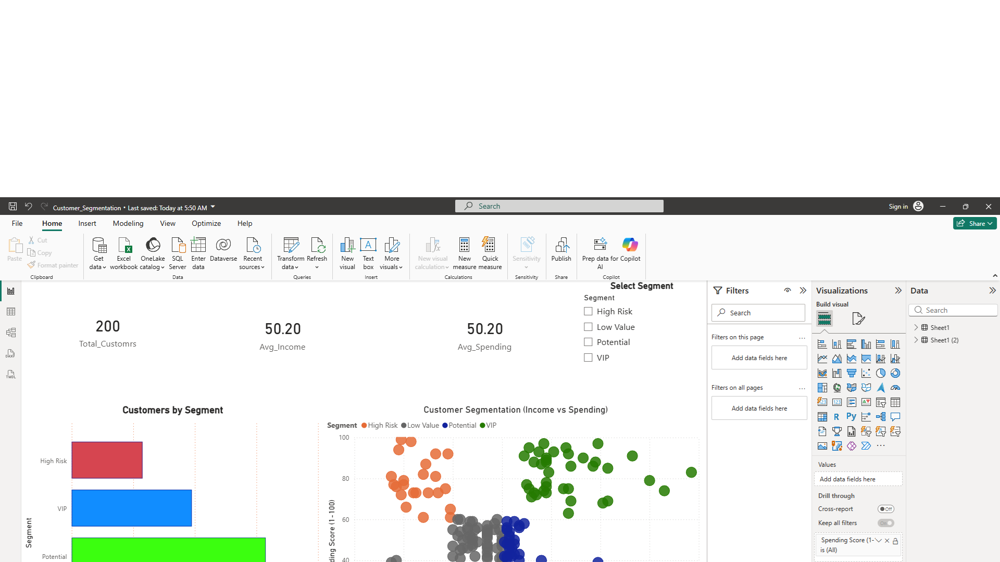

# 📊 Customer Segmentation Analysis

A complete data analysis and machine learning project to segment customers based on income and spending behavior, with an interactive Power BI dashboard.

---

## 📌 Business Problem

Companies need to understand customer behavior to improve marketing strategies and increase profitability.
This project helps identify valuable customer segments using data analysis and machine learning.

---

## 🧠 Project Overview

This project segments customers based on their income and spending behavior using K-Means Clustering.

The goal is to identify different customer groups and provide actionable insights to support business decision-making.

---

## 🛠 Tools & Technologies

* Python (Pandas, Scikit-learn)
* Power BI
* Excel

---

## 📊 Key Analysis Steps

* Data Cleaning & Preparation
* Feature Selection
* Data Scaling
* K-Means Clustering
* Customer Segmentation
* Data Visualization

---

## 🧩 Customer Segments

* VIP Customers (High Income, High Spending)
* Potential Customers (High Income, Low Spending)
* High Risk Customers (Low Income, High Spending)
* Low Value Customers (Low Income, Low Spending)

---

## 🧠 Insights

* VIP customers are the most valuable and should be retained with loyalty programs
* Potential customers represent strong growth opportunities
* High-risk customers require careful targeting strategies
* Low-value customers contribute the least to overall revenue

---

## 🎯 Business Recommendations

* Focus marketing efforts on VIP customers
* Increase engagement with potential customers
* Apply controlled promotions for high-risk customers
* Reduce marketing spend on low-value segments

---

## 📊 Dashboard

---

## 🚀 Key Outcome

This project demonstrates how data-driven insights can support business decision-making and improve customer targeting strategies.

---

## 📁 Project Files

* customer_segmentation_analysis.ipynb → Python analysis
* Customer_Segmentation_Data.xlsx → dataset
* Customer_Segmentation_Report.xlsx → summary
* dashboard.png → Power BI dashboard

---

## 🚀 Conclusion

This project demonstrates how data analysis and machine learning can be used to understand customer behavior and improve business performance.
